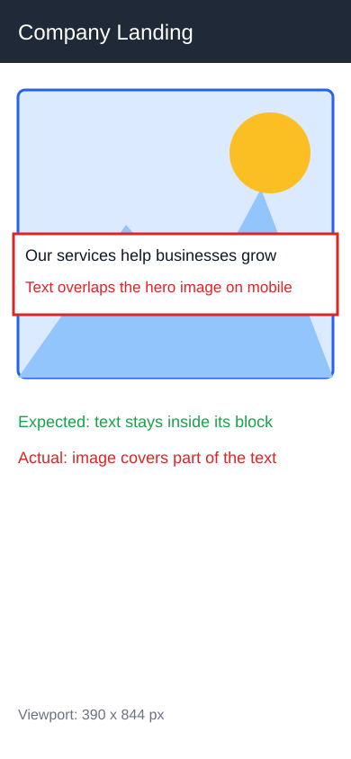

# Результаты заданий Git и GitHub

Здесь собраны подтверждения всех трёх частей задания.

## Задание 1 — Issue по дефекту мобильной вёрстки

- Учебный репозиторий: [netology-code/git-2-homeworks-issues](https://github.com/netology-code/git-2-homeworks-issues)
- Созданный Issue: [#9829 — текстовый блок наезжает на изображение на мобильном экране](https://github.com/netology-code/git-2-homeworks-issues/issues/9829)
- Ответственный отмечен в тексте Issue: [@solarrust](https://github.com/solarrust)

### Описание проблемы

На главной странице NeuroStartUp текстовый блок «Воспользуйтесь современными возможностями искусственного интеллекта...» наезжает на изображение при просмотре в мобильном браузере.

### Шаги воспроизведения

1. Открыть главную страницу NeuroStartUp в мобильном браузере Chrome.
2. Пролистать страницу до блока «Воспользуйтесь современными возможностями искусственного интеллекта...».

### Ожидаемый результат

Текст не наезжает на изображение и остаётся полностью читаемым.

### Фактический результат

Текст наезжает на изображение, часть содержимого закрыта.

### Программное окружение

- Устройство: iPhone 8+ (iOS 12.1)
- Браузер: Chrome (70.0.3538.75)

### Скриншот



## Задание 2 — Pull Request

- Исходный репозиторий: [netology-code/git-2-homeworks-pr](https://github.com/netology-code/git-2-homeworks-pr)
- Форк: [Danila990087/git-2-homeworks-pr](https://github.com/Danila990087/git-2-homeworks-pr)
- Issue с заданием: [#1 — в README не указаны контакты компании](https://github.com/netology-code/git-2-homeworks-pr/issues/1)
- Созданный Pull Request: [#9823 — добавлены контакты компании в README.md](https://github.com/netology-code/git-2-homeworks-pr/pull/9823)

В форке в конец `README.md` добавлены строки согласно Issue #1:

```text
Тел: 8 800 333 55 22
Email: support@test.ru
```

## Задание 3 — GitHub Pages

- Репозиторий портфолио: [Danila990087/danila-portfolio](https://github.com/Danila990087/danila-portfolio)
- Опубликованный сайт: [danila990087.github.io/danila-portfolio](https://danila990087.github.io/danila-portfolio/)
- Исходный текст сайта: [README.md](README.md)
